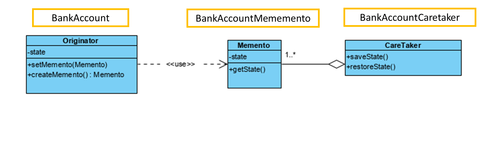

# Example

This example illustrate the use of Memento pattern to manage the state of a bank account , and to implement undo operation.
- BankAccount.Memento class represents the state of the BankAccount,
- BankAccount class is the originator that creates and restores its state from mementos,
- MementoCaretaker class acts as the caretaker, managing the stack of mementos.
- The Main class demonstrates creating a bank account, performing operations, and undoing the last operation using the Memento pattern.

# Exercíse

1. Modify `BankAccountCaretaker` class in order to replace the `Stack<Memento>` object with a `Map<Date,Memento>` object.
2. Modify the `saveMomento` method in order to save the moment with the actual date.
3. Add a method to retrieve the Collecion of dates where are `Memento` instances saved.
4. Replace the undo operation, for a `void restore(Date date)`, where the originator is restored to the a specific date.
5. Update the `Main` to test the new feature of restoring BankAccount to a previous specific state.
